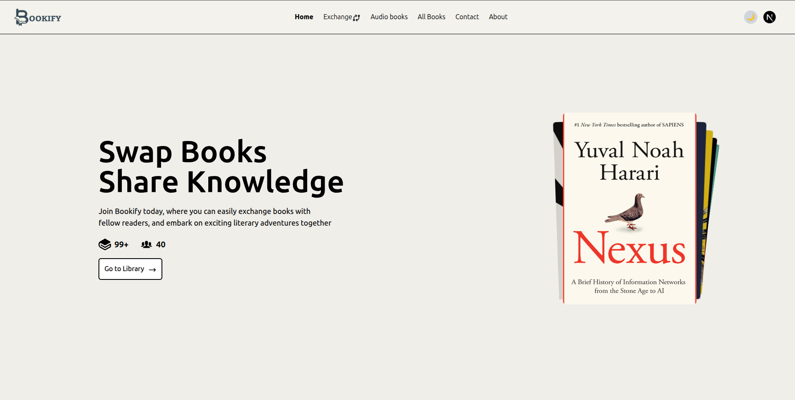

<br />
<p align="center">
  <a href="">
    
  </a>
<p>

<p align="center">
  Bookify is a book exchange web app that allows users to easily exchange single or multiple books with others. Users can also message each other before completing an exchange, ensuring a smooth and efficient process.
It also includes AI-generated book summaries to help users explore content before making a decision.
Users can listen to audiobooks and use voice search to find books quickly and conveniently.
Each book has a preview feature so users can read a sample before exchanging.
An admin dashboard allows efficient management of users, books, and exchange requests.
</p>

<table align="center">
  <tr>
    <td></td>
    <td></td>
  </tr>
  <tr>
    <td></td>
    <td></td>
  </tr>
</table>

**🔗 Live Site:** [Bookify](https://bookify06.vercel.app)  
**💻 Backend Repo:** [GitHub - Bookify Backend](https://github.com/Mdafsarx/Bookify-Backend)

## Main Features

- Users can exchange single and multiple books with other people.
- Chat with book owners to discuss details before exchanging.
- Instantly AI-generated summaries for a quick overview of books.
- Voice search to quickly find books using speech.
- Audiobooks for users who prefer listening to book content.
- Dynamic reviews and ratings on book detail pages to help users make informed decisions.

## Technology Stack

- **Frontend**: Next.js, Context Api, bcryptjs, Tailwind CSS, Shadcn UI, MUI, Flowbite, Framer Motion. Three.js, swiper.js
- **Backend**: Node.js, Express.js
- **Database**: MongoDB
- **Authentication**: NextAuth.js
- **AI Integration**: gemini, Cohere
- **Styling & Animations**: Tailwind CSS, Framer Motion, AOS, Lottie
- **HTTP Client**: Axios
- **State Management & Data Fetching**: TanStack Query

## To Run Locally

```bash
# Clone the repository
git clone https://github.com/Mdafsarx/Bookify.git
cd Bookify

# Install dependencies
npm install

# Set up environment variables
cp .env.example .env

# Start the development server
npm run dev

# The project will run at http://localhost:3000

# Folder Structure

Bookify/
├── .vscode/              # VS Code workspace settings and configurations
├── node_modules/         # Installed npm dependencies and packages
├── public/               # Static assets served directly by the web server
├── src/                  # Main source code directory
│   ├── app/              # Next.js App Router pages and layouts
│   ├── assets/           # Static assets like images, icons, and media files
│   ├── Components/       # Reusable React components and UI elements
│   ├── hooks/            # Custom React hooks for shared logic
│   ├── lib/              # Utility libraries and helper functions
│   └── services/         # API services and external integrations
│   ├── middleware.js     # Express/Next.js middleware functions
│   └── utils.js          # Common utility functions and helpers
├── .eslintrc.json        # ESLint configuration for code linting rules
├── .gitignore            # Specifies files and directories to ignore in Git
├── bookify-logo.png      # Application logo image asset
├── components.json       # Component library configuration (shadcn/ui)
├── dashboard-page.png    # Dashboard page screenshot/mockup
├── exchange-page.png     # Exchange page screenshot/mockup
├── home-page.png         # Home page screenshot/mockup
├── jsconfig.json         # JavaScript project configuration and path mapping
├── next.config.mjs       # Next.js framework configuration file
├── package-lock.json     # npm dependency lock file for consistent installs
├── package.json          # Project metadata, dependencies, and npm scripts
├── postcss.config.js     # PostCSS configuration for CSS processing
├── postcss.config.mjs    # PostCSS configuration (ES module format)
├── README.md             # Project documentation and setup instructions
├── tailwind.config.js    # Tailwind CSS framework configuration
└── users-page.png        # Users page screenshot/mockup
```

## Team

| Role                            | Name           | GitHub                                               |
| ------------------------------- | -------------- | ---------------------------------------------------- |
| Fullstack Developer (Team Lead) | MD Afsar       | [@Mdafsarx](https://github.com/Mdafsarx)             |
| Fullstack Developer             | Sumon Ray      | [@sumon-ray](https://github.com/sumon-ray)           |
| Frontend Developer              | Ajhar Ahmed    | [@Ajhaeahmed3218](https://github.com/Ajhaeahmed3218) |
| Frontend Developer              | Naeemul Islam  | [@naeemul-online](https://github.com/aeemul-online)  |
| Frontend Developer              | Sarfaraj Nawaz | [@Sarfaraj525](https://github.com/Sarfaraj525)       |
| Designer                        | Lisa Thompson  | [@emon50666](https://github.com/emon50666)           |

---

**`Built with by the Next-Six-Avengers team.`**

---

## License

This project is licensed under the MIT License. See the [LICENSE](./LICENSE) file for details.

## Security

For details on reporting security vulnerabilities or issues, please refer to our [SECURITY.md](./SECURITY.md) file.

Thank you for helping us keep Bookify safe and secure!